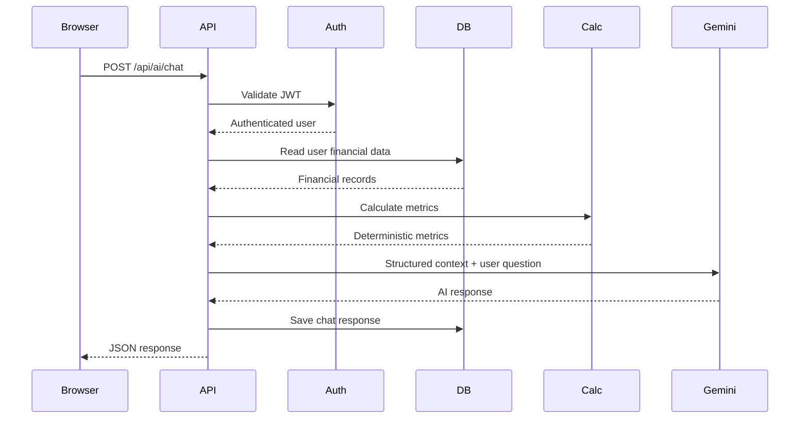

# Personal Finance Adviser Bot
## Technical Architecture

## 1. Architecture Pattern

The application uses a layered full-stack architecture:

```text
React Frontend
      |
      | HTTPS REST API
      v
Express Backend
      |
      +---- Authentication / Authorization
      |
      +---- Controllers
      |
      +---- Services
      |        |
      |        +---- Financial Calculation Engine
      |        |
      |        +---- Gemini AI Service
      |
      v
MongoDB
```

## 2. Technology Stack

| Layer | Technology |
|---|---|
| Frontend | React + Vite + TypeScript |
| Styling | Tailwind CSS |
| Backend | Node.js + Express + TypeScript |
| Database | MongoDB + Mongoose |
| Authentication | JWT + bcrypt |
| AI | Google Gemini API |
| Charts | Recharts |
| Testing | Vitest, Supertest, Playwright |
| API | REST |
| Package Manager | npm |

## 3. Repository Structure

```text
Personal-Finance-Adviser-Bot/
├── frontend/
│   ├── src/
│   │   ├── components/
│   │   ├── pages/
│   │   ├── layouts/
│   │   ├── services/
│   │   ├── hooks/
│   │   ├── types/
│   │   ├── utils/
│   │   └── main.tsx
│   ├── tests/
│   └── package.json
│
├── backend/
│   ├── src/
│   │   ├── config/
│   │   ├── controllers/
│   │   ├── middleware/
│   │   ├── models/
│   │   ├── routes/
│   │   ├── services/
│   │   ├── utils/
│   │   ├── validators/
│   │   └── server.ts
│   ├── tests/
│   └── package.json
│
├── e2e/
├── docs/
├── PRD.md
├── ARCHITECTURE.md
├── RULES.md
├── DESIGN.md
├── TASK.md
├── MEMORY.md
├── README.md
└── .env.example
```

## 4. Database Models

### User

```text
_id
name
email
passwordHash
ageRange
occupation
monthlyIncome
financialKnowledge
riskProfile
createdAt
updatedAt
```

### Transaction

```text
_id
userId
type: income | expense
category
amount
description
date
createdAt
updatedAt
```

### Budget

```text
_id
userId
month
year
income
categoryLimits
totalBudget
createdAt
updatedAt
```

### Goal

```text
_id
userId
name
targetAmount
currentAmount
targetDate
monthlyRequired
createdAt
updatedAt
```

### ChatMessage

```text
_id
userId
role: user | assistant
message
createdAt
```

## 5. API Routes

```text
POST   /api/auth/register
POST   /api/auth/login

GET    /api/users/profile
PUT    /api/users/profile

GET    /api/transactions
POST   /api/transactions
PUT    /api/transactions/:id
DELETE /api/transactions/:id

GET    /api/budget
POST   /api/budget

GET    /api/goals
POST   /api/goals
PUT    /api/goals/:id
DELETE /api/goals/:id

GET    /api/dashboard

POST   /api/calculations/emi
POST   /api/calculations/goal
POST   /api/calculations/budget

POST   /api/ai/chat
GET    /api/ai/history
```

## 6. Request Flow



## 7. AI Context Pipeline

The backend creates a controlled object:

```text
User Profile
+
Recent/Relevant Transactions
+
Goals
+
Budget
+
Deterministic Metrics
+
Conversation Context
+
Current User Question
```

Only required fields are passed to Gemini.

## 8. Financial Calculation Layer

Financial formulas must be implemented as pure/testable functions.

Example:

```text
monthlySurplus = income - totalExpenses

savingsRate = monthlySurplus / income * 100

goalMonthlyContribution =
    (targetAmount - currentAmount) / remainingMonths
```

The calculation service must validate inputs before calculating.

## 9. Authentication Flow

```text
Register
  ↓
Validate input
  ↓
Hash password
  ↓
Create User
  ↓
Login
  ↓
Verify password
  ↓
Generate JWT
  ↓
Frontend stores authentication state
  ↓
Protected requests include token
```

## 10. Error Handling

All API errors should use a consistent structure:

```json
{
  "success": false,
  "message": "Human-readable error message",
  "code": "ERROR_CODE"
}
```

Validation errors should return HTTP 400.

Authentication failures should return HTTP 401.

Authorization failures should return HTTP 403.

Missing resources should return HTTP 404.

Unexpected server failures should return HTTP 500 without exposing stack traces or secrets.

## 11. Security Boundaries

- Gemini credentials exist only in the backend.
- Passwords are never returned by API responses.
- Database queries are scoped by authenticated user ID.
- Client-provided user IDs are not trusted for authorization.
- Input is validated before database writes.
- AI output is treated as untrusted generated content.

## 12. Testing Architecture

```text
Unit Tests
   ↓
Service / Calculation Tests
   ↓
API Integration Tests
   ↓
Security Tests
   ↓
Frontend Component Tests
   ↓
End-to-End Tests
   ↓
Production Build
```
